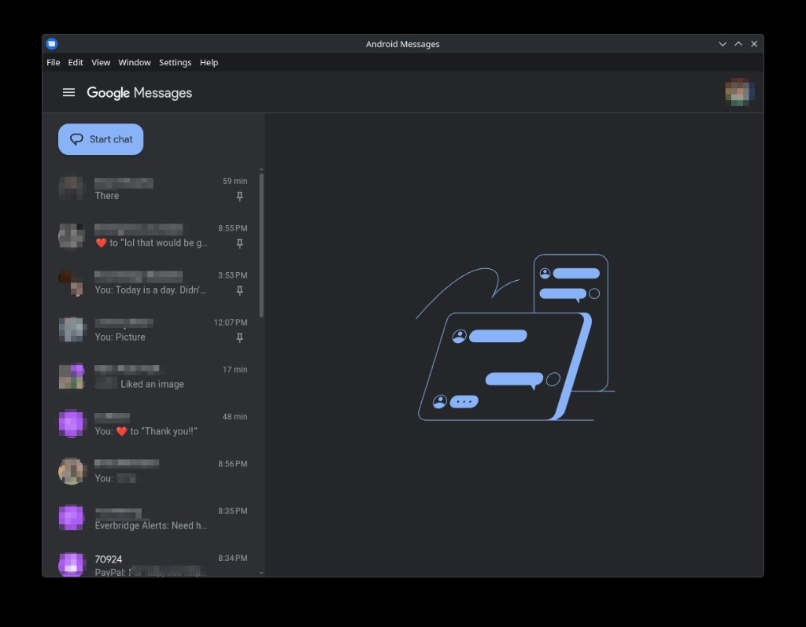
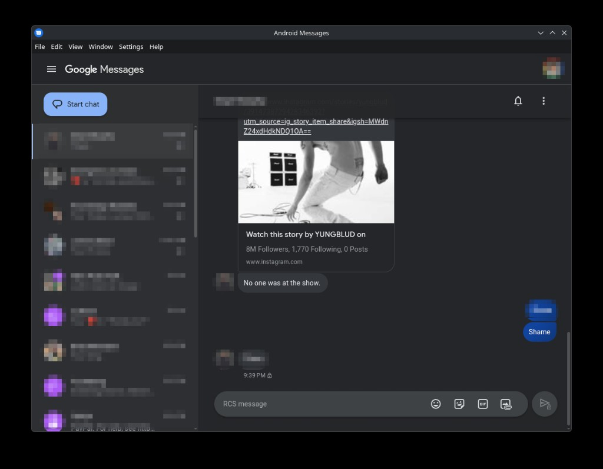

# Android Messages™ Desktop <a href="#"></a>

Run [Google Messages](https://messages.google.com/web) (formerly Android Messages) as a cross-platform desktop app, à la iMessage — for those who'd rather not keep a browser tab open just to text.

**Not affiliated with Google in any way. Android and Google Messages are trademarks of Google LLC.**

---

## Credits & attribution

This project was **created by [Chris Knepper](https://github.com/chrisknepper)** — the original [`android-messages-desktop`](https://github.com/chrisknepper/android-messages-desktop) (MIT). All of the original design and groundwork are his.

This repository is a **modernized fork** maintained by [@joshschools](https://github.com/joshschools). It brings the app up to date with a current Electron and toolchain, replaces APIs that have since been removed from Electron, and adds a round of security hardening — while keeping Chris's architecture and feature set intact. See [CHANGELOG.md](CHANGELOG.md) for the full list of changes.

Originally inspired by:
- [Google Play Music Desktop Player](https://github.com/MarshallOfSound/Google-Play-Music-Desktop-Player-UNOFFICIAL-)
- [a Reddit post on r/Android](https://www.reddit.com/r/Android/comments/8shv6q/web_messages/e106a8r/)
- Built on [electron-boilerplate](https://github.com/szwacz/electron-boilerplate)

---

## Screenshots

**Main window (Linux)**


**Conversation view**


**Incoming notification**
<!--  -->

**Tray / menu bar**
<!--  -->

**Settings menu**
<!--  -->

---

## Features
- System notifications when a text comes in
- Unread notification count on macOS (dock) and supported Linux launchers, plus a Windows tray overlay
- iOS-style pinned conversation shortcuts, managed from each conversation's options menu
- Spellchecking via Electron's built-in (Chromium) spellchecker
- Press-Enter-to-send toggle
- Follow the system light/dark mode setting (no in-app light/dark toggle — switches with your OS theme, or use Google Messages' ⋮ menu when sync is disabled)
- Run in the background on Windows / Linux / macOS
- Minimize to tray on Windows / Linux
- Menu bar support on macOS

## What's new in the modernized fork
- **Electron 7 → 42**, **webpack 4 → 5**, modern Babel toolchain
- Removed the deprecated `remote` module — renderer/webview communicate over IPC only
- Built-in spellchecker replaces the bundled `electron-hunspell` + downloaded dictionaries
- Migrated `electron-settings` v3 → v4 and replaced other removed Electron APIs
- **Security hardening:** webview navigation locked to Google origins, URL-scheme validation before opening links/downloads, OS-sandboxed webview, a permission allowlist, IPC sender validation, and a CSP on the local page (`npm audit`: 0 vulnerabilities)

See [CHANGELOG.md](CHANGELOG.md) for details.

---

## Install

Pushing a `vX.Y.Z` tag triggers CI to build and publish a GitHub Release. Phase 1 ships **unsigned** builds for:
- **Linux** — `.AppImage`, `.deb`, `.pacman`
- **Windows** — `.exe` (NSIS installer) and a portable build

macOS is not built yet (it requires code signing + notarization). Until a release is cut, you can build from source (see [Development](#development)). The original project's releases (which predate this modernization) are on the [upstream releases page](https://github.com/chrisknepper/android-messages-desktop/releases/latest).

### Arch Linux (AUR)
A `-bin` package definition lives in [`packaging/aur/`](packaging/aur/) (installs the released AppImage). See its [README](packaging/aur/README.md) for building/publishing.

### Verifying Linux downloads
Linux artifacts are GPG-signed (when a signing key is configured), with a detached `.asc` next to each file and the public key published as `signing-key.asc` on the release:
```bash
gpg --import signing-key.asc
gpg --verify android-messages-desktop-<version>.AppImage.asc android-messages-desktop-<version>.AppImage
```

**Note:** Windows builds are not code-signed yet, so SmartScreen will warn on first run.

---

## Spellchecking
Powered by Electron's built-in spellchecker (the same engine Chromium uses). The language follows your operating system's language setting, and the dictionary is fetched and managed by Electron automatically. Right-click a misspelled word to see suggestions or add it to your personal dictionary.

---

## Development
Make sure you have a recent [Node.js](https://nodejs.org) (18+) installed, then:

```bash
git clone https://github.com/joshschools/android-messages-desktop.git
cd android-messages-desktop
npm install
npm start
```

### Start in development mode
```bash
npm start
```
Compiles the app with webpack in watch mode and launches Electron.

### Compile without launching
```bash
npm run compile
```
Produces the bundled `app/background.js`, `app/app.js`, and `app/bridge.js`.

### Notifications in development on KDE Plasma 6 (Wayland)
Plasma 6's Wayland notification service drops notifications whose `desktop-entry` hint doesn't match an installed `.desktop` file, which the unpackaged dev app doesn't have. Installed builds ship a generated `.desktop` file, so this only affects `npm start`. To test notifications during development, run under X11:
```bash
env -u ELECTRON_RUN_AS_NODE ./node_modules/.bin/electron . --ozone-platform=x11
```

---

## Building & packaging
We use [electron-builder](https://github.com/electron-userland/electron-builder) for packaging; build options live under the `"build"` key in `package.json` ([configuration docs](https://www.electron.build/configuration/configuration)).

```bash
npm run build       # compile + package for the current platform (no publish)
npm run build-all   # compile + package for macOS, Windows, and Linux
```
The resulting installers are written to the `dist/` directory.

### Cutting a release
1. Commit everything for the release (including `README.md` and `CHANGELOG.md`).
2. `npm version <major|minor|patch>` — bumps `package.json` and creates a git tag.
3. `git push && git push --tags`
4. `npm run release` — packages and publishes (requires a GitHub token with write access in `GH_TOKEN`).
5. Publish the draft release on GitHub, matching the release name to the tag (including the leading `v`).

### Icons
Icons are generated from [`assets/android_messages_desktop_icon.png`](assets/android_messages_desktop_icon.png) with [png2icons](https://www.npmjs.com/package/png2icons):
```bash
npm run generate-icons
```

---

## Testing
The original Spectron-based unit/e2e suite was removed because [Spectron is archived](https://github.com/electron-userland/spectron) and incompatible with modern Electron. Re-introducing a test suite (e.g. with [Playwright for Electron](https://playwright.dev/docs/api/class-electron)) is tracked as future work.

---

## License
[MIT](LICENSE) © [Chris Knepper](https://github.com/chrisknepper) and contributors.
